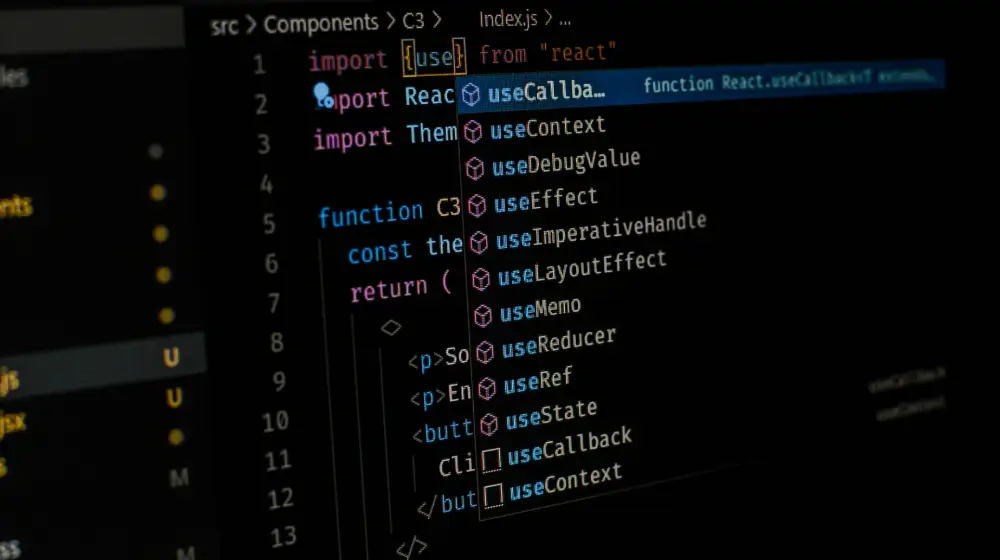

# 🚀 Meu Portfólio Pessoal

Bem-vindo ao meu site pessoal! Este projeto é uma página de portfólio desenvolvida com HTML, CSS e JavaScript puro, com foco em design responsivo, animações suaves e estilo moderno.

---

## 📌 Funcionalidades

- 🌙 Tema escuro estiloso
- 🧍 Seção de perfil com avatar
- 📖 Seções "Sobre mim" e "Experiência"
- 📱 Layout responsivo (Mobile Friendly)
- 🎯 Animações com CSS
- 🔗 Navegação suave (scroll suave via JS)

---

## 🧠 Tecnologias usadas

- **HTML5** para estrutura
- **CSS3** com media queries e animações
- **JavaScript Vanilla** para navegação suave
- **Google Fonts** (Poppins)
- Sem frameworks ou bibliotecas externas 🎉

---

